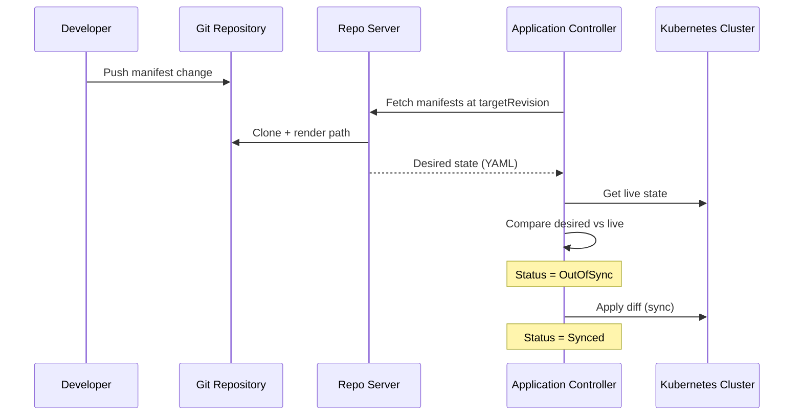

# Step 5 — Sync & Image Updates

This lab demonstrates the core GitOps loop: **change Git → ArgoCD detects drift → sync applies the change**.

## Guestbook Image Availability

Google migrated guestbook images from GCR to Artifact Registry. As of today, **only `v5` is published**:

| Tag | Registry status |
|-----|-----------------|
| v1 – v4 | Not available (404) |
| **v5** | Available |
| v6+ | Not available (404) |

All manifests use the official image:

```yaml
image: us-docker.pkg.dev/google-samples/containers/gke/gb-frontend:v5
```

The legacy path `gcr.io/google-samples/gb-frontend:v5` still resolves, but Artifact Registry is recommended.

Environments differ by **replicas**, not image tag:

| Environment | Replicas | Image |
|-------------|----------|-------|
| dev | 1 | v5 |
| staging | 2 | v5 |
| prod | 3 | v5 |

## How ArgoCD Sync Works



1. **Repo Server** clones your Git repo and reads the path for each Application (e.g. `manifests/guestbook/dev`).
2. **Application Controller** compares rendered manifests with live cluster resources.
3. If different → application shows **OutOfSync**.
4. On sync (manual or automated) → controller applies the diff.
5. Kubernetes reconciles pods to match the new desired state.

## Lab Exercise — Trigger Sync via Git Change (dev)

Since only `v5` exists, this exercise changes **replicas** in Git to demonstrate the sync loop. The same flow applies when image tags are updated.

Current dev deployment in `manifests/guestbook/dev/deployment.yaml`:

```yaml
replicas: 1
image: us-docker.pkg.dev/google-samples/containers/gke/gb-frontend:v5
```

### Step 1: Edit Git

Change replicas from `1` to `2`:

```yaml
replicas: 2
```

Commit and push:

```bash
git add manifests/guestbook/dev/deployment.yaml
git commit -m "Scale guestbook dev to 2 replicas"
git push origin main
```

### Step 2: Observe OutOfSync

**UI:** Refresh `guestbook-dev` — status changes to **OutOfSync**.

**CLI:**

```bash
argocd app diff guestbook-dev
argocd app get guestbook-dev
argocd app sync guestbook-dev
```

### Step 3: Verify

```bash
kubectl get deployment guestbook-ui -n dev
kubectl get pods -n dev -l app=guestbook-ui
```

Expected: 2 running pods in the `dev` namespace.

> **Note:** `guestbook-staging` and `guestbook-prod` are independent — changes under `manifests/guestbook/dev/` only affect dev.

### Step 4: Access the UI

ClusterIP is internal-only. Port-forward to your laptop:

```bash
kubectl port-forward svc/guestbook-ui -n dev 8081:80
```

Open http://localhost:8081

## Lab Exercise — Image Field Change (optional)

If you want to practice editing the image field specifically, switch from Artifact Registry to the legacy GCR path (same `v5` tag):

```yaml
image: gcr.io/google-samples/gb-frontend:v5
```

Push and sync — ArgoCD detects the image field change and rolls the deployment even though the underlying image is the same.

## Image Update with Argo Rollouts

For `guestbook-rollout`, edit `manifests/guestbook-rollout/rollout.yaml` and change replicas or the image path, then:

```bash
argocd app sync guestbook-rollout
kubectl argo rollouts get rollout guestbook-ui --watch
```

## Troubleshooting

| Problem | Fix |
|---------|-----|
| `ImagePullBackOff` with v1–v4 or v6 | Use `v5` only — other tags are not published |
| App stays `Unknown` | Check repo credentials: `argocd repo list` |
| App stays `OutOfSync` | Run `argocd app sync guestbook-dev` |
| `PermissionDenied` | Verify AppProject `destinations` and `sourceRepos` |
| `Namespace is not permitted in project` | Add `Namespace` to `clusterResourceWhitelist` in `project.yaml` |

## What You Learned

- Git is the single source of truth for deployments
- ArgoCD continuously reconciles cluster state with Git
- Manifest changes (replicas, image, env) all flow through the same sync loop
- Only `gb-frontend:v5` is currently available from Google Samples
